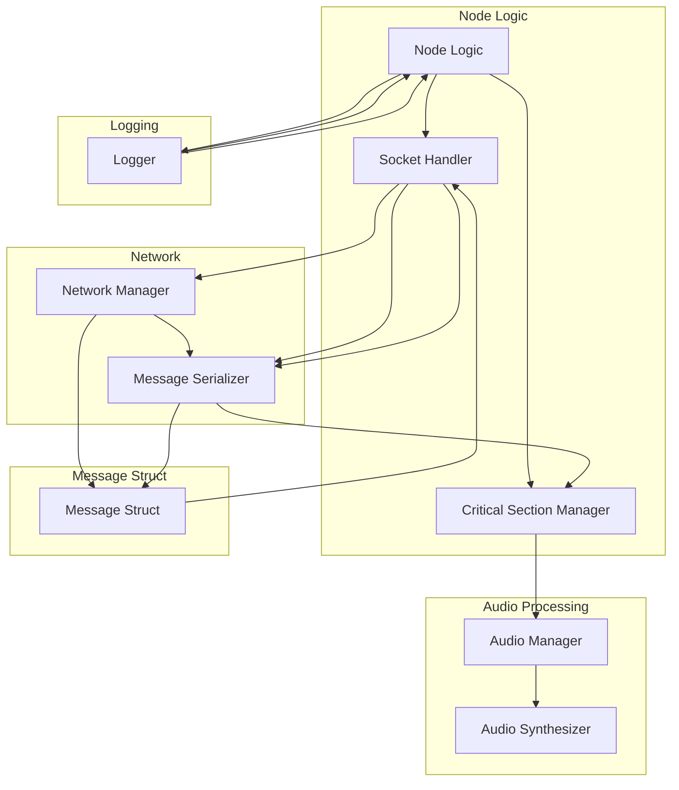

# 📌 Ricart-Agrawala per la Sintesi Vocale

Il repository contiene un progetto basato su sistema distribuito per la mutua esclusione utilizzando l'algoritmo Ricart-Agrawala, arricchito con sintesi vocale per un'interazione dinamica con l'utente.


      


## 📖 Come Usare

### Parte 1: Setup del Sintetizzatore Vocale

1. **Crea l'ambiente Conda**:

   ```bash
   conda create --name ric_agr_project python==3.9
   ```

2. **Attiva l'ambiente**:

   ```bash
   conda activate ric_agr_project
   ```

### Installazione delle Dipendenze

1. Naviga nella cartella del sintetizzatore vocale:

   ```bash
   cd ric_agr_project/audio_synthesizer
   ```

2. Installa le dipendenze necessarie:

   ```bash
   pip install -r requirements.txt
   ```

### Scarica il Modello (Opzionale)

Per usare il sintetizzatore vocale, scarica il modello:

```bash
python -m TTS.utils.download --model_name "tts_models/en/ljspeech/tacotron2-DDC"
```

### Esegui il Sintetizzatore

1. Esegui il file `synthesizer.py`:

   ```bash
   python synthesizer.py
   ```
2. Per personalizzare il contenuto, modifica la variabile `text` all'interno del file.
3. Il risultato in formato `.WAV` sarà salvato nella cartella `output_audio`.

---

## 🔧 Setup e Build dell'Algoritmo

1. **Naviga nella cartella del progetto**:

   ```bash
   cd ric_agr_project
   ```

2. **Installa le dipendenze**:

   ```bash
   make install_deps
   ```

3. **Compila l'eseguibile**:

   ```bash
   make
   ```

4. **Esegui il simulatore dei nodi**:

   ```bash
   make run
   ```

5. **Pulisci l'ambiente** (opzionale):

   ```bash
   make clean
   ```

---

## 🎮 Funzionalità

✔ Sistema distribuito basato sull'algoritmo di Ricart-Agrawala

✔ Sintesi vocale con Mozilla TTS

✔ Prevenzione del deadlock

✔ Comunicazione tra nodi tramite TCP/IP

✔ Integrazione fluida del feedback vocale

---

## 🖼 Diagramma del Sistema



## 🔧 Struttura dei Moduli Principali del Progetto

```
/ric_agr_project
│── synthesizer.py        # Script per la sintesi vocale
│── audio_synthesizer/    # Cartella per i componenti audio
│── Makefile              # Makefile per costruire ed eseguire l'algoritmo
│── main.cpp              # File principale per la simulazione dei nodi
│── node.cpp              # Logica dei nodi e gestione
│── network.cpp           # Strato di comunicazione tra i nodi
│── logger.cpp            # Logger per tracciare gli eventi
│── audio_manager.cpp     # Gestione audio per la sintesi vocale
```

---

## 🛠 Miglioramenti Futuri


- Migliorare la tolleranza ai guasti
- Aggiungere una dashboard grafica per il monitoraggio in tempo reale
- Ottimizzare le prestazioni e la scalabilità per un numero maggiore di nodi

---

## 📜 Licenza

Questo progetto è open-source sotto la **Licenza MIT**.

---

## 💡 Crediti


Creato da [Arianna Agresta](https://github.com/Arianna6400), [Emanuele Biccheri](https://github.com/Emanuele1087650), [Emanuele Fares](https://github.com/FaresEmanuele).

---

### 🚀 Divertiti e Buon Lavoro! 🎉
